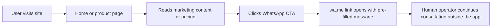

# Architecture

## Overview
Info no Zap is a frontend-only single-page application that markets vehicle plate and CPF lookup services and directs users to WhatsApp to start a consultation. The repository contains the public website, pricing pages, shared UI primitives, and deployment configuration, but no backend, database, or serverless API routes.

## Tech Stack
- Runtime: Node.js `25.1.0`, Bun `1.3.1`
- Build tooling: Vite `5.4` with `@vitejs/plugin-react-swc`
- Frontend: React `18`, TypeScript `5`
- Routing: `react-router-dom`
- Styling: Tailwind CSS, shadcn/ui, Radix UI
- State and utilities: TanStack React Query, `react-hook-form`, `zod`
- Hosting: Vercel
- External integration: WhatsApp deep links via `wa.me`

## Project Structure
```text
.
|-- public/                 # Static files
|-- src/
|   |-- components/         # Page sections and shared components
|   |   |-- ui/             # shadcn/ui primitives
|   |   |-- cpf/            # CPF-specific section components
|   |   |-- Header.tsx
|   |   |-- HeroSection.tsx
|   |   |-- HowItWorks.tsx
|   |   |-- Benefits.tsx
|   |   |-- CTASection.tsx
|   |   |-- FAQ.tsx
|   |   `-- Footer.tsx
|   |-- hooks/              # Reusable React hooks
|   |-- lib/                # Shared helpers and constants
|   |-- pages/              # Route-level pages
|   |-- App.tsx             # Providers and route mapping
|   |-- main.tsx            # React bootstrap
|   `-- index.css           # Global styles and design tokens
|-- docs/                   # Project documentation
|-- index.html              # HTML entry document + analytics snippet
|-- package.json            # Dependencies and scripts
|-- vite.config.ts          # Vite config and path alias
|-- tsconfig.json           # TypeScript path alias
|-- components.json         # shadcn/ui configuration
`-- vercel.json             # SPA routing for deployment
```

## Routes
| Path | Page | Description |
| --- | --- | --- |
| `/` | `Home` | Product hub: links to placas and CPF landings |
| `/placas` | `Placas` | Vehicle plate landing (hero, how it works, benefits, CTA, FAQ) |
| `/placas/planos` | `PlacasPlanos` | Vehicle plate consultation pricing (4 tiers) |
| `/cpf` | `Cpf` | CPF consultation landing page |
| `/cpf/planos` | `CpfPlanos` | CPF consultation pricing |
| `/planos` | — | Legacy redirect → `/placas/planos` |
| `*` | `NotFound` | Catch-all 404 page |

## Application Architecture

```mermaid
flowchart TD
    indexHtml["index.html"] --> mainTsx["src/main.tsx"]
    mainTsx --> appRoot["src/App.tsx"]
    appRoot --> providers["QueryClientProvider + TooltipProvider + Toaster"]
    appRoot --> routeHome["/"]
    appRoot --> routePlacas["/placas"]
    appRoot --> routePlacasPlanos["/placas/planos"]
    appRoot --> routeCpf["/cpf"]
    appRoot --> routeCpfPlanos["/cpf/planos"]
    appRoot --> routeLegacy["/planos → redirect"]
    appRoot --> routeNotFound["*"]
    routeHome --> headerHome["Header"]
    routeHome --> homeHero["Home hero + product cards"]
    routeHome --> footerHome["Footer"]
    routePlacas --> headerA["Header"]
    routePlacas --> hero["HeroSection"]
    routePlacas --> howItWorks["HowItWorks"]
    routePlacas --> benefits["Benefits"]
    routePlacas --> ctaSection["CTASection"]
    routePlacas --> faq["FAQ"]
    routePlacas --> footerA["Footer"]
    routePlacasPlanos --> headerB["Header"]
    routePlacasPlanos --> pricing["Pricing cards (4 tiers)"]
    routePlacasPlanos --> footerB["Footer"]
    routeCpf --> cpfHero["cpf/HeroSection"]
    routeCpf --> cpfHowItWorks["cpf/HowItWorks"]
    routeCpf --> cpfBenefits["cpf/Benefits"]
    routeCpf --> cpfCta["cpf/CTASection"]
    routeCpf --> cpfFaq["cpf/FAQ"]
    routeCpfPlanos --> cpfPricing["CPF pricing card"]
```


## User Flow


## Key Modules
- `src/App.tsx`: Initializes the React Query client, UI providers, and browser routes.
- `src/pages/Home.tsx`: Product hub linking to placas and CPF flows.
- `src/pages/Placas.tsx`: Composes the vehicle plate landing page from reusable section components.
- `src/pages/PlacasPlanos.tsx`: Vehicle plate consultation pricing (4 tiers).
- `src/pages/Cpf.tsx`: CPF consultation landing page (uses `src/components/cpf/` sections).
- `src/pages/CpfPlanos.tsx`: CPF consultation pricing.
- `src/lib/whatsapp.ts`: Stores the WhatsApp number used by CTA links.
- `src/lib/utils.ts`: Exposes `cn()` for Tailwind class merging.
- `src/hooks/use-mobile.tsx`: Detects mobile viewport state using a `768px` breakpoint.
- `src/hooks/use-toast.ts`: Manages in-memory toast state for the shadcn toast system.

## UI Layer
The app uses a two-level UI structure:

- Page sections in `src/components/` implement the marketing content and page composition.
- CPF-specific sections in `src/components/cpf/` mirror the shared section components for the CPF product.
- Reusable primitives in `src/components/ui/` provide the shadcn/ui component library. The repository currently includes 48 UI primitives such as `button`, `card`, `accordion`, `dialog`, `toast`, and `form`.

`components.json` configures shadcn/ui with the `slate` base color, CSS variables, and the `@/` path aliases used throughout the app.

## Data and Integration Model
This repository does not contain a backend, API handlers, or database models. All business interactions leave the app through WhatsApp links.

- `src/lib/whatsapp.ts` exports the number `551926603532`.
- CTA components build a `wa.me` URL with a pre-filled message.
- Consultation handling happens manually outside this codebase after the user reaches WhatsApp.

TanStack React Query is configured at the app root, but there are currently no `useQuery` or `useMutation` calls in the codebase.

## Deployment
- `index.html` includes the Google Ads `gtag.js` snippet for conversion tracking.
- `vite.config.ts` defines the dev server on port `8080` and the `@` alias to `src`.
- `vercel.json` rewrites all non-file routes to `/`, enabling SPA routing in production.
- The project is intended to be published through Lovable and deployed on Vercel at `https://infonozap.com.br`.

## Development
Common local commands:

- `bun dev`: Start the Vite development server
- `bun build` or `npm run build`: Create a production build
- `npm run lint`: Run ESLint

TypeScript path aliases are defined in `tsconfig.json` so imports can use `@/*` instead of relative paths.
